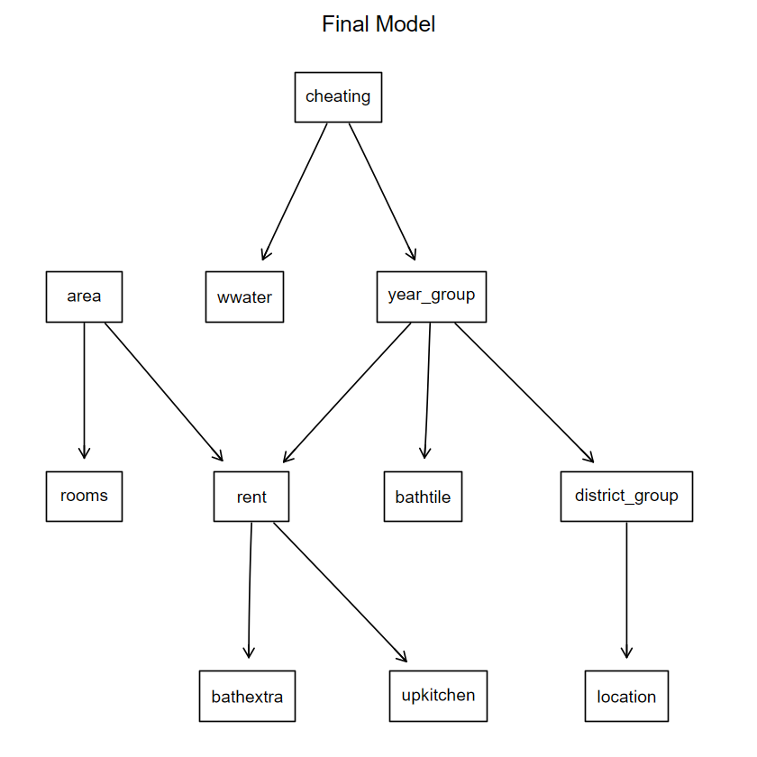

# Project Summary
### Introduction

The dataset used in this project is integrated within the `LinRegInteractive` (`R` package). Use codes below to:

1. **See the dataset description**:


```{r}
install.packages("LinRegInteractive")
library(LinRegInteractive)
data(munichrent03)
?munichrent03
```
Sample of 2,053 appartments from the data collected for the preparation of the Munich rent index 2003. A data frame with 2,053 observations on the following 12 variables:
- `rent`: Net rent in EUR (numeric).
- `rentsqm`: Net rent per square meter in EUR (numeric).
- `area`: Floor area in square meters (numeric).
- `rooms`: Number of rooms (numeric).
- `yearc`: Year of construction (numeric).
- `bathextra`: High quality equipment in the bathroom? (Factor)
- `bathtile` : Bathroom tiled?(Factor)
- `cheating` : Central heating available? (Factor)
- `district`: Urban district where the apartment is located. (Factor with 25 levels)
- `location`: Quality of location. Ordered factor with levels "normal", "good" and "top".
- `upkitchen`: Upscale equipment in kitchen? (Factor)
- `wwater` : Hot water supply available? (Factor)

Source: [https://data.ub.uni-muenchen.de/2/](https://data.ub.uni-muenchen.de/2/), for more details see the [Package description](https://cran.r-project.org/web/packages/LinRegInteractive/LinRegInteractive.pdf) (page 26).

2. **Export the dataset as a csv file**:

```{r}
write.csv(munichrent03,file="munichrent03.csv")
```

--- 

From the description of this dataset, we can come up with several business questions, such as: 

- What factors (direct or indirect) influence the rent?
- Which district has the highest rental prices?
- What amenities are typically available in the houses?
- If a house is equipped with premium amenities, what price segment is it most likely to belong to?
  
These business questions can be addressed through common data analysis methods, including data exploration, descriptive statistics, and visual tools that reveal patterns and relationships. 

A Directed Graphical Model (Bayesian Network - BN), on the other hand, can help us explore conditional independence relationships between variables. For example, we may want to know whether the number of rooms in a house is related to its rental price when the living area is already known. Beyond that, if we have questions that involve certain known conditions, the model allows us to compute conditional probabilities to answer them. This process is known as querying the model. 

---

### Tasks:
| Description | Tools|
|--|--|
|Export data from `R`| `R`|
|Exploratory Data Analysis | [`Python`](Munich_EDA.ipynb)|
|Analysis using BN| [`R`](Munich_BN.ipynb)|


---

### Key takeaways
(See [`Python code`](Munich_EDA.ipynb) and  [`R code`](Munich_BN.ipynb) for all the details)
#### 1. Exploratory Data Analysis

##### 1.1. Dataset properties:

  - No missing values.
  - Some numeric variables are not actually continous: 
    - `yearc`: represents the year of construction and only takes discrete year values.
    - `rooms`: indicates the number of rooms, which are integers ranging from 1 to 6.

##### 1.2. Findings:

  - Most apartments are equipped with basic facilities, whereas high-end or upscale features are relatively uncommon.


      |Variable|Description|Yes rate (%)|
      |--|--|--|
      |cheating|Central heating available? |91.48|
      |wwater| Hot water supply available?| 96.49|
      |bathtile|Bathroom tiled?|81.49|
      |**bathextra**|High quality equipment in the bathroom?|**9.3**|
      |**upkitchen**|Upscale equipment in kitchen?|**7.31**|
    
  - Top 10 districts by number of apartments:

      |Neuh-Nymp|177|
      |--|--|
      |Lud-Isar|161|
      |Au-Haid|139|
      |SchwWest|137|
      |Maxvor|132|
      |Laim|117|
      |Ram-Per |115|
      |Th-Ob-Fo-Fu-So|106|
      |Bogenh |98|
      |Ugies-Har |82|

  - Houses equipped with amenities tend to have a higher average `rent`, which is a reasonable trend in reality.

  - `location` clearly affects `rent`. Apartments in `good` and `top` locations tend to have higher average rents than those in `normal` areas, which aligns with real-world trends. However, most apartments fall into the `normal` and `good` categories:

      |`location`|count|
      |--|--|
      |normal|    1205|
      |good|       803|
      |top|         45|  

    and many of them still have very high rents (sometimes matching or exceeding those in the `top` group), suggesting that `location` is not the only factor influencing `rent`.

  - Finally, `area` and number of rooms (`rooms`) have a positive linear correlation with `rent`, meaning that `rent` tends to increase as these two variables increase. Meanwhile, the correlation between year of construction (`yearc`) and `rent` is quite weak.

#### 2. Analysis using BN

<p align="center">
  
</p>

- `rent` is directly related to the property's area (`area`), year of construction (  `year_group`), and the presence of high-quality bathroom and upscale kitchen equipment (  `bathextra` and `upkitchen`). The remaining factors are indirectly related to the `rent` through these direct factors. 

- Once the direct factors are known, the indirect ones become conditionally independent of `rent`, i.e., they no longer affect its probability

- Most houses are equipped with basic amenities, while high-end amenities are very rare (similar to what was observed in the EDA).

- A house equipped with high quality equipment in the bathroom and upscale equipment in the kitchen is likely to fall into the following rent segments:

    |`rent`|Probability (%)|
    |--|--|
    | [€77.31, €406.13]| 0.520| 
    |(€406.132, €687.072] |14.514|
    |(€687.072, €1789.55] |84.966|

  
